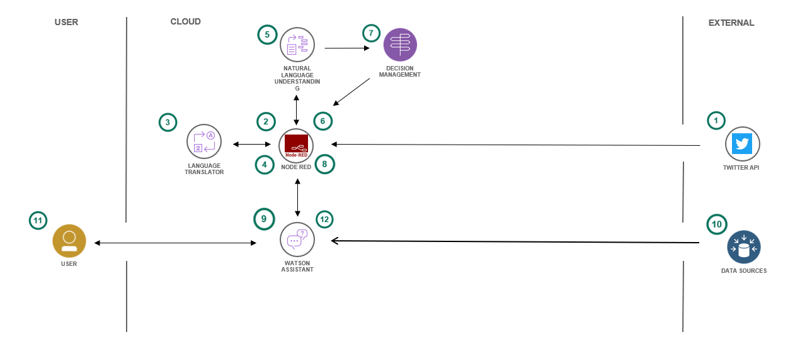
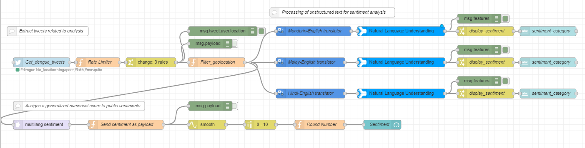
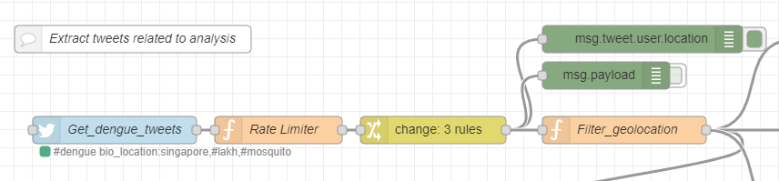
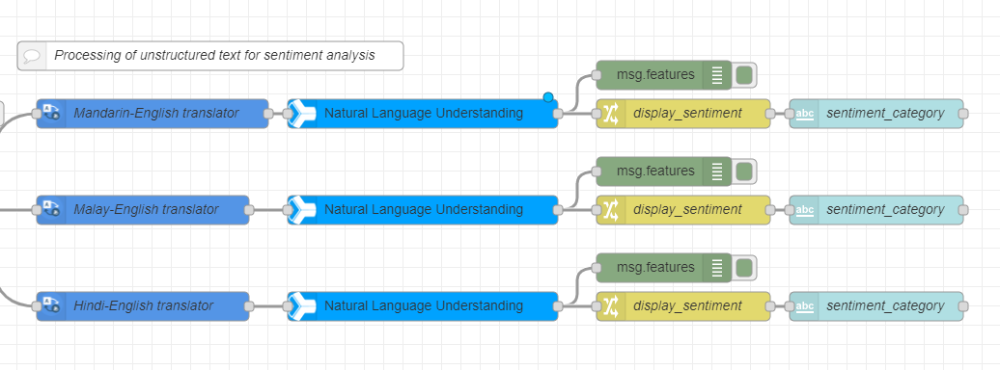
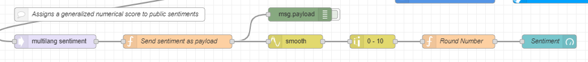

# Innochamp_SCDFXIBM

# Innochamp:Adapt2bot_SCDFXIBM

  
Innochamp consists of Ajay Philip Koshy, Teo Jun Wei, Heng Gene Yeo, Ni Jiaying and Jessica Li Yuyao. We are a group of university students passionate about incorporating smart technology to facilitate emergency crisis efforts by SCDF. We developed "Adapt2bot" in response to the SCDFXIBM innovation challenge 2020.

## Contents

1. [Short description](#short-description)
1. [Demo video](#demo-video)
1. [The architecture](#the-architecture)
1. [Detailed description](#detailed-description)
1. [Node-red flow](#node-red-flow)
1. [Demo for chatbot](#chatbot-demo)
1. [Project roadmap](#project-roadmap)
1. [Getting started](#getting-started)
1. [Built with](#built-with)
1. [Versioning](#versioning)
1. [Authors](#authors)
1. [License](#license)
1. [Acknowledgments](#acknowledgments)

## Short description

### What's the problem?
PREVENTING THE SPREAD (COVID/DENGUE)
As we advance into the future, unprecedented problems such as the Coronavirus could occur. People react to these major issues differently, they might panic, be nonchalant, or even be unaware of the problems. Each of these reactions lead to its unique problems. For example, panicking about the coronavirus could lead to over buying of necessities. SCDF could play a part in mitigating the negative impacts of such issues, with an upstream approach of educating the communities and tactfully advising the community on the actions they should take, based on the way they are reacting to the issues. This will allow SCDF to prevent the escalation of certain situations.

### The idea
Adapt2bot is an upstream solution for preventing the escalation of issues that integrates IBM cloud technology. The main idea behind it is to evaluate the nation’s response to a particular crisis and curate specific responses through a chatbot, which educates and tactfully advises the nation on the correct steps to take, based on how the people are reacting.

### Our solution

Our solution: Stopping the spread of fear and ignorance of emergency events by providing curated information based on the public opinion on similar international events. 

One way to deal with this problem is to measure the level of awareness and preparedness of the population and formulate target measures to deal with the problem. We do so by gathering the public responses to current issues worldwide including those which have yet happened in Singapore (Covid, Terrorism, BLM…) through social media platforms such as Twitter. We would filter out non-local data and apply Natural Language Understanding for sentiment and emotion analysis on the data to gain some insight on how concerned and well-prepared local residents are. Based on their result from sentiment and emotion analysis, the public would be categorised into five different levels of panic (over-concerned, concerned, unaware, ignorant and nonchalant). 
The results of sentiment and emotion analysis are used to curate the responses of the chatbot. We train our chatbot with the capability of giving targeted responses to the public on current issues. Whenever a user approaches the chatbot, the text he/she sends would be analysed by Watson Assistant using Natural Language Understanding and machine learning to extract entities and intents of the user question. Based on the analysis, this user would be categorised and chatbot would provide targeted responses accordingly.  
These activities are able to meet the needs of the specific groups and also acts as an *upstream solution* to curb and stop problems before they even arise.
It's imperative that learning and creating can continue when educational institutions have to shift the way they teach in times of crises, such as the COVID-19 pandemic. Providing a set of open source tools, backed by IBM Cloud and Watson Services, will enable educators to more easily make content available for their students.

## Demo video

## The architecture

1. A stream of tweets related to the crisis in discussion is grabbed from the linked twitter API and fed into NODE-RED using specified twitter hashtags periodically according to preset intervals.
2. NODE-RED filters the stream of tweets using a geo-operator to narrow the tweets to those coming from Singapore.
3. The IBM Watson Language translator nodes embedded onto NODE-RED translates the multilingual tweet inputs into standard English to be recognized by the IBM Watson Natural Language Understanding nodes.
4. NODE-RED grabs the translated texts and feeds them into IBM Watson Natural Language Understanding nodes.
5. IBM Watson Natural Language Understanding nodes processes and analyzes the input text using the Keywords feature, generating scores on the dimensions of “sentiment”, “relevance” and “emotions” which is parametrized by “sadness”, “joy”, “fear”, “disgust” and “anger”.
6. Dashboard functions on NODERED extracts the scores with respect to “sentiment” and visualize the data.
7. Decision management performs a threshold analysis on the scores generated by IBM Watson Natural Language Understanding and sorts the metrics into five different levels of panic (over-concerned, concerned, unaware, ignorant and nonchalant).
8. NODE-RED receives status from decision management and calls the IBM Watson Assistant.
9. Watson Assistant is trained using external data sources for each of the five scenarios and responds to the status reported by NODE-RED.
10. External data sources is tailored to each of the five different levels of panic and produces five different sets of replies to user inquiries when fed into Watson Assistant.
11. The user visits the chatbot enabled by NODE-RED and interacts with the chatbot on the crisis at hand. 
Watson Assistant uses natural language understanding and machine learning to extract entities and intents of the user question.

## Detailed description
The hyperlink to a detailed description of Adapt2bot can be found at: 

## Node-red flow
The overall node-red flow after importing our  can be visualized as such: 

The overall node-red flow can be broken down into three modules:
1. The tweet extraction module extracts tweets from Twitter API for analysis and filters away the undesirable tweets for analysis. Target tweets are those from Singapore and are relevant to the crisis in analysis, ie. Dengue.

2. The target tweets, in the form of text, are fed into the IBM Watson Language translator and IBM Watson Natural Language Understanding nodes for sentiment analysis.

3. Using a pre-developed multilang sentiment node, an overall sentiment score is assigned to the twitter feeds and scaled to the 0-10 dimension for cleaner data visualization.

## Chatbot demo
IBM Watson Studio Assistant is used to provide a user interface for chatbot communication. We pre-trained two chatbots on the extreme spectrums of the emotion outputs, nonchalant and panic for demonstration purposes.

The preview link for the chatbot tailored to nonchalant sentiments can be found at: [nonchalant.chatbot.preview](https://web-chat.global.assistant.watson.cloud.ibm.com/preview.html?region=eu-gb&integrationID=553aa513-a252-416d-b600-fafaf8fc1350&serviceInstanceID=518a91b5-639b-4917-b04b-ae6abb6f0e17)

The preview link for the chatbot tailored to panic sentiments can be found at: [panic.chatbot.preview](https://web-chat.global.assistant.watson.cloud.ibm.com/preview.html?region=us-south&integrationID=72404ffb-d4a8-4aa7-b55f-4aaaae248c73&serviceInstanceID=80720d1b-b845-437e-a994-845b8bdfa6b2)

## Project roadmap

## Getting started

## Built with

* [Twitter API](https://developer.twitter.com/en/docs/api-reference-index) - A twitter app is created from Twitter developer account to generate credentials and API keys
* [IBM Cloud Natural Language Understanding](https://www.ibm.com/cloud/watson-natural-language-understanding) - Incorporated into node-red for social media analytics
* [IBM Cloud Language Translator](https://cloud.ibm.com/apidocs/language-translator)
* [IBM Cloud Watson Assistant](https://www.ibm.com/cloud/watson-assistant/) - Used to initialize and train chatbots
* [IBM Cloud node-red](https://nodered.org/)

## Authors
Team Innochamp for IBMXSCDF innovation challenge.

## Acknowledgments

* Based on [IBMxSCDF's README template](https://github.com/Code-and-Response/Project-Sample/blob/master/README.md#project-roadmap)
